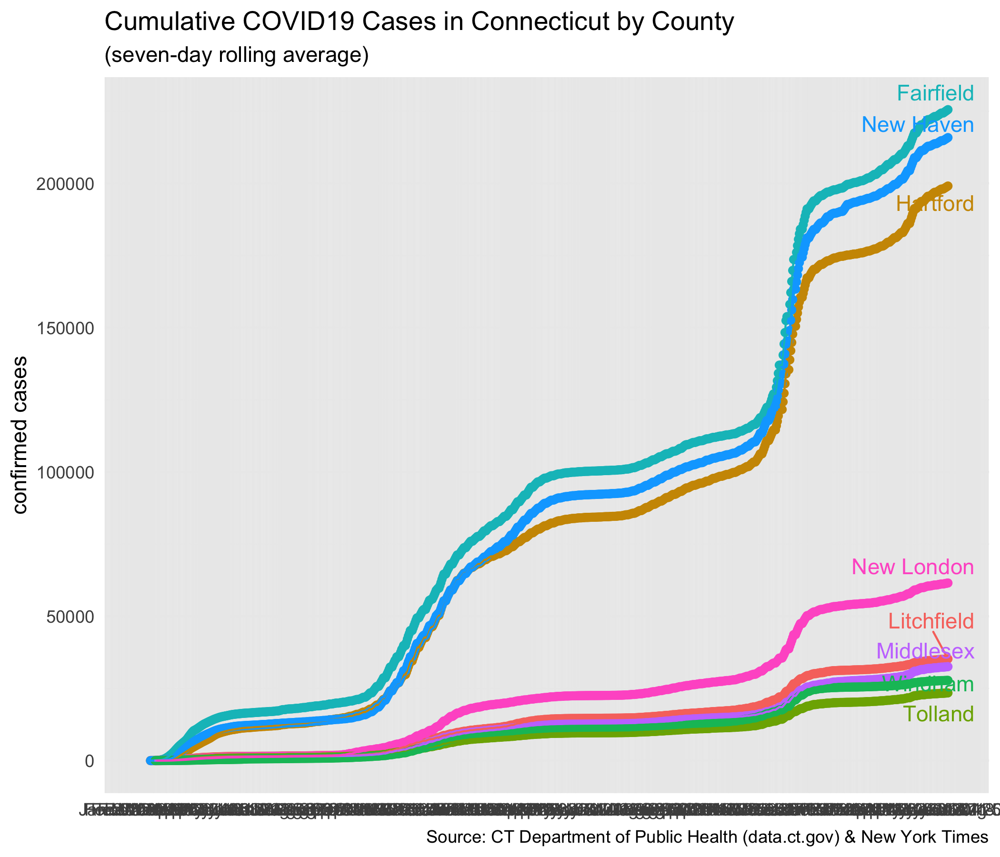
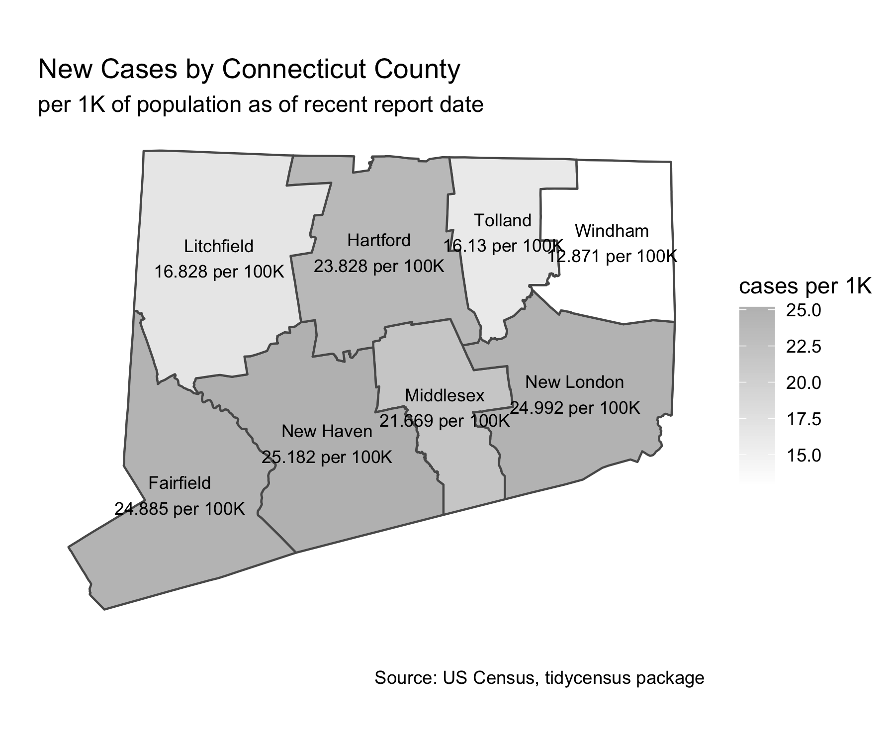
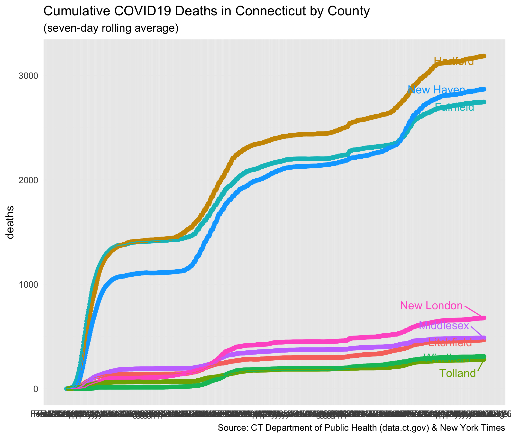
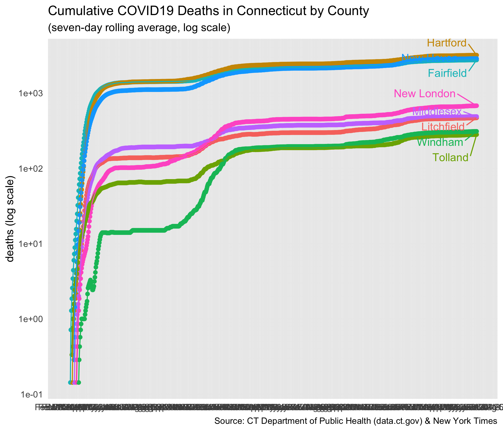
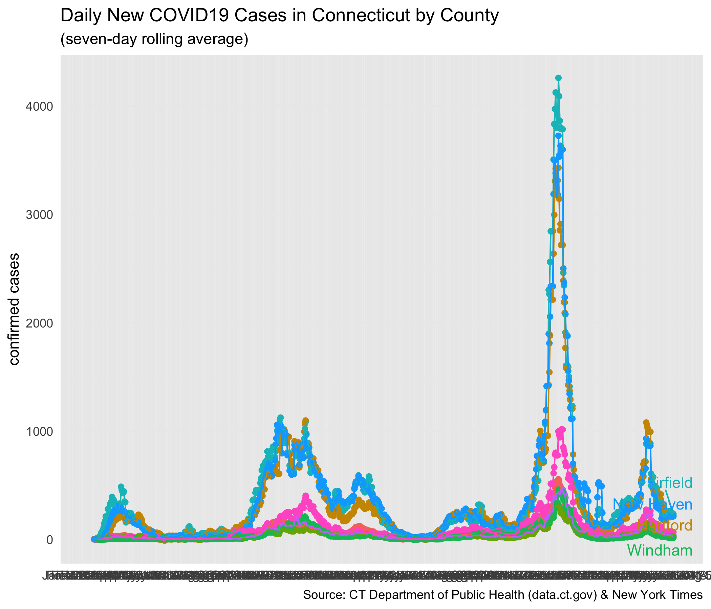
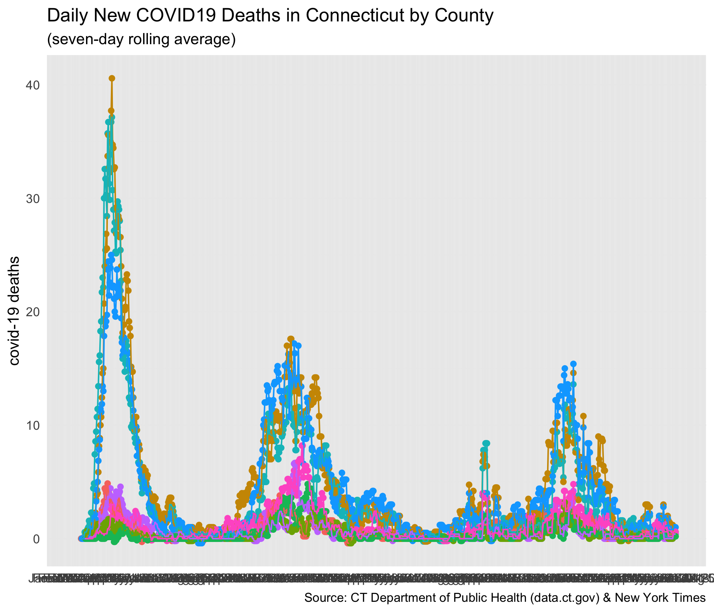

A [later post](/project/) provides a better view of the 2020-2022 data on Covid-19 in Connecticut.

[Note, my later code has been updating the charts displayed here and
the additional data is not display well now that it covers two years
of data. Basically I had my moment with covid data, and I'm not
trying to keep it up to date here.]

The data comes directly from [data.ct.gov](https://data.ct.gov/browse?q=COVID-19%20data&sortBy=relevance) so that makes it easier to do this daily update. There also is more data available, and I will use it to make some additions to these plots.

The most visible change is that the counts are now smoothed using a rolling average over a seven-day period. This evens out some of the day to day variation.

As the curve has become flattened it is has become interesting to focus on the number of new cases and new deaths each day. I have added some plots of new counts rather than only cumulative counts.

The first plot tracks the cumulative number of confirmed cases of Covid-19 in Connecticut.

The cumulative number of cases is plotted on a log scale, which makes it easier to compare the rate of growth among the eight counties of Connecticut. Similar slopes signal similar growth rates. The qualifier "confirmed" is important. It is widely acknowledged that there are many cases with clear symptoms of Covid-19 for which no positive test has been done to confirm that diagnosis. In these plots the count of "confirmed cases" only includes cases with a positive laboratory test.  

Notes on the plot show when some of Governor Lamont's [executive orders](https://portal.ct.gov/Coronavirus/Pages/Emergency-Orders-issued-by-the-Governor-and-State-Agencies) went into effect.

The next figure displays the same counts of confirmed cases, but does not use a log scale. If you are unfamiliar with looking at log scales, this may provide a clearer display of the relative magnitude of cases among the counties.\
  

Note that there are some cases and deaths for which the county is unknown. According to the New York Times, they will follow up with the state sources to get those resolved. As of 4/3/2020 the Department of Public Health lists 218 confirmed cases as "pending address validation" and two deaths. Those cases are not in the figure.

Because some of us may be a bit unclear about the location of all eight Connecticut counties, here is a map showing the county boundaries. The gray scale provides an indication of the cumulative cases per 100,000 persons in each county based on the most recent data.  

#### Cumulative Covid-19 Deaths in Connecticut

The next two plots show the cumulative counts of deaths attributed to Covid-19. Before Aprirl 15, that required a positive lab test for the virus. That was changed so that a death is included if Covid-19 is included on the death certificate, even if there was no laboratory test for the virus.  

   Here is the same data from the plot above, this time presented on a log scale. On the log scale it is easier to see changes in the rate of growth.  

#### New Cases

How many new cases of Covid-19 are reported each day? The next plot has daily new cases, averaged over a seven-day period.

Here is the plot of deaths reported each day, again smoothed with a seven-day rolling average. Fairfield appeaers to be past a peak and the number of deaths each day is beginning to decline.

#### Hospitalizations

The next plot shows hospitalizations with Covid-19. This shows "the number of patients currently hospitalized with laboratory-confirmed COVID19 by county based on data collected by the Connecticut Hospital Association. The distribution is by location of hospital, not patient residence." Note that unlike the plots above, this one is **not** cumulative. It is people currently in hospital.

#### Changes in the Rate of Increase of Cases and Deaths

The next plot attempts to summarize the change in the the growth rate of confirmed cases and deaths. In the log plots for cases and deaths, the slope of the line is directly tied to the rate of incrase. In this plot we want to evaluate how those slopes are changing. In particular, we are looking for a sign that the curve is flattening as the slope become more shallow.

One way to evaluate how rapidly something is growing on an exponential curve is to calculate the [doubling time](https://en.wikipedia.org/wiki/Doubling_time), or the time it takes for the quantity to double. For example, during an early week in Fairfield County, the cumulative count of confirmed cases was doubling in a little over every two days. Each bars show the doubling time for each one week period. We hope to see the bars get longer as more time passes under influence of the measurres to reduce interactions that enable spread of the virus.

Looking at deaths in Fairfield, New Haven, and Hartford counties, we can see some sign that the doubling time is getting longer. As I write this on April 12, there is clear evidence that the doubling time for the cumulative count of deaths in Fairfield County has lengthened. The doubling time is still 3 and 4 in Hartford, New Haven, and Middlesex Counties.

The change in how fast the growth rate of cases or deaths is changing is confusing. It's sort of the growth rate of the growth rate. Perhaps in the future I will add some plots that show the number of additional cases and deaths each day rather than the cumulative counts. That might be easier to interpret.

#### Comments as of April 12

Note that I do not necessarily update these comments each time I update the number from the Department of Public Health. So the comments may lag behind the data.

One large uncertainty is how the count of cases confirmed by a positive test relates to the total number of cases in the population including those who have not been tested. Ideally we would be counting how many people have been infected. That is probably a much larger number than the number of confirmed tests. Some have speculated that it might be 100 times larger.

The slope of the trends on the log plot of the confirmed cases are decreasing. We can see that most clearly in Fairfield and New Haven. That's what needs to happen to [flatten the curve](https://www.livescience.com/coronavirus-flatten-the-curve.html). Perhaps "deaths" are also showing a decrease in the slope, but that's most clear in Fairfield. "Deaths" are probably a better measure of the extent of covid-19 infection in Connecticut, but when a death occurs it may be one or two weeks after the case tested positive.

Hopitalizations have levelled off in Fairfield County, but are still increasing in New Haven and Hartford. That suggests that the growth in deaths in Fairfield should stop soon, but continue for at least another week or two in New Haven and Hartford.

I'm not an epidemiologist and I don't claim any expertise with this kind of data. I plan to update this post as time passes and we get more data. As someone who just turned 70, I'll be staying home in front of my computer aside from necessary trips to get food and a vigorous daily walk.

For another view of this data, see the blog post at the [Connecticut Data Collaborative](https://www.ctdata.org/blog/stopping-the-spread-using-trusted-data-sources-to-prevent-misinformation-about-covid-19).

  
#### How Deaths Are Counted as Covid-19 Deaths

On April 9, the [daily update](https://portal.ct.gov/-/media/Coronavirus/CTDPHCOVID19summary4092020.pdf?la=en) says the following about deaths:

> For public health surveillance, laboratory-confirmed COVID-19-associated deaths are defined as patients who tested positive for COVID-19 around the time of death; this is not a determination of the cause of death.

On April 10, the [daily update](https://portal.ct.gov/-/media/Coronavirus/CTDPHCOVID19summary4102020.pdf?la=en) text was changed to this:

> For public health surveillance, COVID-19-associated deaths include persons who tested positive for COVID-19 around the time of death and persons who were not tested for COVID-19 whose death certificate lists COVID-19 disease as a cause of death or a significant condition contributing to death

The earlier statement seemed to restrict the count to persons with a positive test. The later statement incudes person for whom COVID-19 is included on the certificate.

There were 380 deaths as of April 9 and 448 as of April 10. That's not an unusual increase. I checked the wording because there is an unusual jump between April 14 and April 15, a 29% increase to 868 on April 15.

There is a related note on the [CDC page that describes counts in US](https://www.cdc.gov/coronavirus/2019-ncov/cases-updates/cases-in-us.html):

> \*As of April 14, 2020, CDC case counts and death counts include both confirmed and probable cases and deaths. This change was made to reflect an interim COVID-19 position statement issued by the Council for State and Territorial Epidemiologists on April 5, 2020. The position statement included a case definition and made COVID-19 a nationally notifiable disease.

> A confirmed case or death is defined by meeting confirmatory laboratory evidence for COVID-19. A probable case or death is defined by i) meeting clinical criteria AND epidemiologic evidence with no confirmatory laboratory testing performed for COVID-19; or ii) meeting presumptive laboratory evidence AND either clinical criteria OR epidemiologic evidence; or iii) meeting vital records criteria with no confirmatory laboratory testing performed for COVID19.

   \#### Some Methodological Notes

The doubling times were calculated for each seven-day period for each county. I used least squares regression to fit a line to the natural log to the cumulative count for each day. The estimated coefficient for days gives me the slope of the line and is the estimated daily growth rate for week. To get the doubling time, the formula is

doubling-time = log(2) / (1 + r)

where "r" is the estimated daily growth rate.

I started making these plots because data was available from a [repository](https://github.com/nytimes/covid-19-data) made maintained by The New York Times. It takes some time for NYT to update their data, so I started updating the series by typing in data taken directly from the Connecticut Department of Public Health which provides an [update](https://portal.ct.gov/Coronavirus) via a PDF file at the end of each day. (Click on the box that says "TEST DATA".) That report also had data on hospitalizations.

Now the data is directly available from [data.ct.gov](https://data.ct.gov/browse?q=COVID-19%20data&sortBy=relevance). It's now easy and fast for me to update my plots each day. I even get an email each day telling me that the data at `data.ct.gov` has been updated.    The R code that created these plots is available in a [GitHub repository](https://github.com/johngoldin/ctcorona).    

#### An Interesting Video That Explores Factors That Affect an Epidemic

This is not directly related to the data for Connecticut, but I wanted to put in a plug for a very impressive video that uses animated simulations to illustrate how various parameters affect the epidemic. It's about 20 minutes long and it is well worth your time. It's from the site [3blue1brown](https://www.3blue1brown.com/) by Grant Sanderson.



He also has an earlier video that describes [exponential growth](https://www.3blue1brown.com/videos-blog/exponential-growth-and-epidemics) in general and how it applies to describing an epidemic. It explains why using a log scale is a good way to plot the number of cases.
