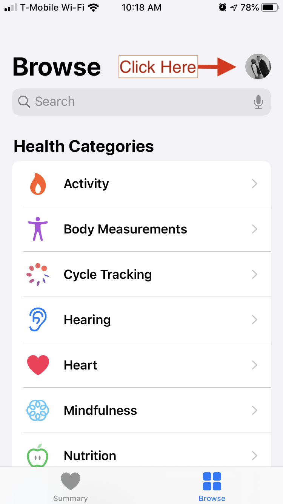
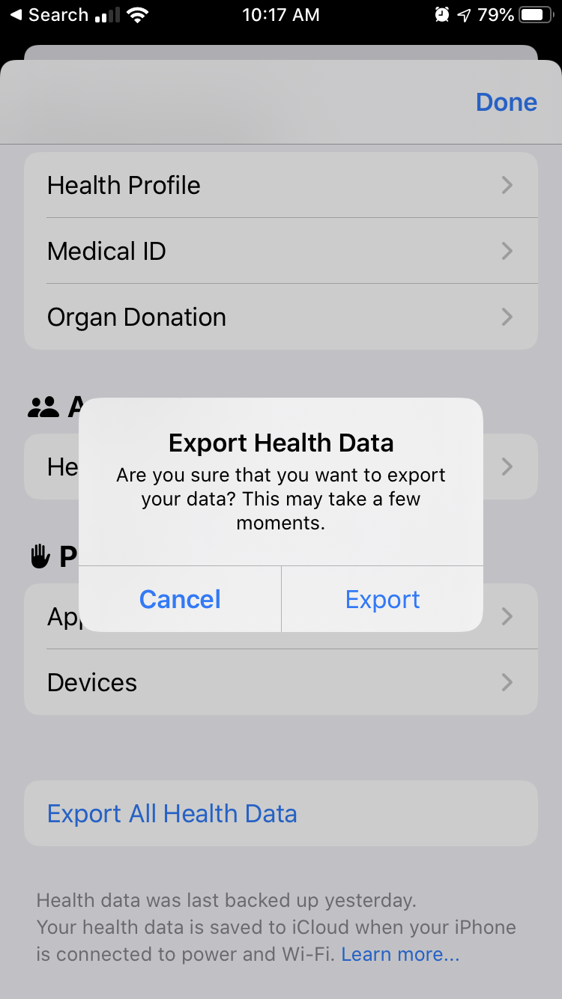

This post will work through the mechanics of moving data from the Apple Health app
out of your iPhone and into R where you can analyze it. Next it will offer some
tips on how to prepare and clean up the data a bit. Finally, it will 
explore some of the properties of the types of data available
via the Health app.

##### First, export the data from the Health app

From the Health app on your iPhone, one can export all of the data you are able to view via the Health app. 
Open the Health app on your iPhone. 
To export, you need to first go to your personal settings by
clicking on your icon near the upper right corner of the Browse screen. 
(See the the first screenshot below.)
Click on the icon and you will see some of your personal settings. 
You will need to scroll to the bottom of this page, where you will
see a clickable line "Export All Health Data", as shown in the second screenshot below. 

<style> 
.row {
  display: flex;
}
.column {
  flex: 100%;
  padding: 5px;
}
</style>
<div class="row">
  <div class="column">
    <figure>
      <figcaption> Browse Health app</figcaption>
      
    </figure>
  </div>
  <div class="column">
    <figure>
      <figcaption>Export All Health Data</figcaption>
      
    </figure>
  </div>
</div>
Once you click OK to go ahead with the export, it may take a significant amount of time.
On my iPhone 8 it takes more than five minutes. Once it is complete, you'll get a 
dialog that asks where to send the exported data. I use AirDrop to send it to the
Mac where I am running RStudio. It ends up in the Downloads folder on that Mac.
If you need to move the data to a Windows computer, you may need to send it
via email or Dropbox.
The exported file is named `export.zip`. If you double-click on that file it 
will expand into a folder called `apple_health_export`. The uncompressed file is huge
in comparison with the size of the zip file. In my case, `export.zip` is about
79 megabytes while the `apple_health_export` folder is 2.45 gigabytes!
In my R code, I uncompress the file into my Downloads folder, which is excluded
from my Time Machine backups.

##### R code to expand the export file and import it as XML data

The R code below shows how to decompress `export.zip` and follow some
basic steps to import it into R. I'm following in the footsteps of
several people who have published code to accomplish these steps.
See  work by [Ryan Praskievicz](https://gist.github.com/ryanpraski/ba9baee2583cfb1af88ca4ec62311a3d), [Taras Kaduk](https://taraskaduk.com/2019/03/23/apple-health/), [Raul Eulogio](https://www.inertia7.com/projects/149), and [Deepankar Datta](https://github.com/deepankardatta/AppleHealthAnalysis) (who has
created a package called AppleHealthAnalysis). I'm sure there are other examples
using R, and there are quite a number of examples using python (e.g., by [Mark Koester](http://www.markwk.com/data-analysis-for-apple-health.html).

The R code uncompresses the zip file and replaces the `apple_health_export` folder. The
big file inside that folder is `export.xml`. We
use the XML package to covert the major elements of the XML file into
tidy data frames.

```{r}
library(tidyverse, quietly = TRUE)
library(jsonlite, quietly = TRUE)
library(lubridate, quietly = TRUE)
library(XML, quietly = TRUE)

rc <- unzip("~/Downloads/export.zip", exdir = "~/Downloads", overwrite = TRUE)
if (length(rc) != 0) file.remove("~/Downloads/export.zip")
# once unzipped, delete export.zip. Otherwise, the next time Air Drop sends export.zip
# to your mac it will be renamed as export2.zip and you may accidentally process
# an out-of-date set of data.

system.time(     # takes a bit more than 20 seconds on my iMac
xml <- xmlParse("~/Downloads/apple_health_export/export.xml"))
system.time(     # takes about 70 seconds on my iMac
df <- XML:::xmlAttrsToDataFrame(xml["//Record"], stringsAsFactors = FALSE) %>% 
 as_tibble() %>% mutate(value = as.numeric(value))

df_activity <- XML:::xmlAttrsToDataFrame(xml["//ActivitySummary"]) %>% as_tibble()
df_workout <-  XML:::xmlAttrsToDataFrame(xml["//Workout"], stringsAsFactors = FALSE) %>% as_tibble 
df_clinical <- XML:::xmlAttrsToDataFrame(xml["//ClinicalRecord"]) %>% as_tibble()
```

I won't get into details of the XML structure of the health export.
For most purposes, the Record, ActivitySummary, Workout, and Clinical data types
will provide all that you are looking for. My expanded Apple Health Export
folder also includes workout GPX files, electrocardiograms, and clinical
records imported from my physician's medical records system.

I have a bit over two years of Apple Watch data in my iPhone. There is a lot of
data in the Apple Health Export. In fact, after a full career working
as a data analyst, this is the largest number of data points
I have ever dealt with. Extracting the "Record" data  from `export.xml` produces
3.4 million rows and takes about 70 seconds on my 2019 iMac. 

The counts by "type"  and "sourceName" describe the breadth and quantity of data:

|type                                               |     Watch|   Phone| Lose It!| Other|     Total|
|:--------------------------------------------------|---------:|-------:|--------:|-----:|---------:|
|HKQuantityTypeIdentifierActiveEnergyBurned         | 1,236,768|       0|        0|     1| 1,236,769|
|HKQuantityTypeIdentifierBasalEnergyBurned          |   754,729|       0|        0|     0|   754,729|
|HKQuantityTypeIdentifierDistanceWalkingRunning     |   539,816| 136,122|        0|     1|   675,939|
|HKQuantityTypeIdentifierHeartRate                  |   546,869|       0|        0| 1,363|   548,232|
|HKQuantityTypeIdentifierStepCount                  |    49,152| 130,003|        0|     1|   179,156|
|HKQuantityTypeIdentifierAppleExerciseTime          |    45,654|     337|        0|     0|    45,991|
|HKQuantityTypeIdentifierFlightsClimbed             |    11,533|  10,455|        0|     1|    21,989|
|HKCategoryTypeIdentifierAppleStandHour             |    17,616|       7|        0|     0|    17,623|
|HKQuantityTypeIdentifierHeartRateVariabilitySDNN   |     3,672|       0|        0|     0|     3,672|
|HKQuantityTypeIdentifierDietaryFatTotal            |         0|       0|    3,486|     0|     3,486|
|HKQuantityTypeIdentifierDietaryFatSaturated        |         0|       0|    3,056|     0|     3,056|
|HKCategoryTypeIdentifierSleepAnalysis              |         0|       0|        0| 2,972|     2,972|
|HKQuantityTypeIdentifierDietaryEnergyConsumed      |         0|       0|    2,836|     0|     2,836|
|HKQuantityTypeIdentifierDietaryProtein             |         0|       0|    2,670|     0|     2,670|
|HKQuantityTypeIdentifierDietaryFiber               |         0|       0|    2,621|     0|     2,621|
|HKQuantityTypeIdentifierDietarySodium              |         0|       0|    2,619|     0|     2,619|
|HKQuantityTypeIdentifierDietarySugar               |         0|       0|    2,563|     1|     2,564|
|HKQuantityTypeIdentifierDietaryCholesterol         |         0|       0|    2,481|     0|     2,481|
|HKQuantityTypeIdentifierAppleStandTime             |     1,827|       0|        0|     0|     1,827|
|HKQuantityTypeIdentifierBloodPressureDiastolic     |         0|       0|        0| 1,786|     1,786|
|HKQuantityTypeIdentifierBloodPressureSystolic      |         0|       0|        0| 1,786|     1,786|
|HKQuantityTypeIdentifierDistanceCycling            |     1,415|       0|        0|     0|     1,415|
|HKQuantityTypeIdentifierEnvironmentalAudioExposure |     1,342|       0|        0|     0|     1,342|
|HKQuantityTypeIdentifierRestingHeartRate           |       745|       0|        0|     0|       745|
|HKQuantityTypeIdentifierWalkingHeartRateAverage    |       666|       0|        0|     0|       666|
|HKQuantityTypeIdentifierBodyMass                   |         0|       1|      158|     1|       160|
|HKQuantityTypeIdentifierVO2Max                     |       111|       0|        0|     0|       111|
|HKCategoryTypeIdentifierMindfulSession             |        52|       0|        0|     0|        52|
|HKQuantityTypeIdentifierHeight                     |         0|       1|        0|     1|         2|
|HKQuantityTypeIdentifierDietaryCaffeine            |         0|       0|        0|     1|         1|
|HKQuantityTypeIdentifierDietaryCarbohydrates       |         0|       0|        0|     1|         1|
|HKQuantityTypeIdentifierNumberOfTimesFallen        |         1|       0|        0|     0|         1|
|Total                                              | 3,211,968| 276,926|   22,490| 7,916| 3,519,300|

Most of the data comes the Apple Watch. I have been using the **Lose It!** app on my iPhone for about six months to count calories,
and that produces quite a bit of data. The free version of the app which I am using does not display much beyond
basic calorie counts. It's interesting to see that the more detailed nutrition breakdowns are passed
into the Health app even without paying for the upgrade. I haven't attempted to look at any of the
nutrition information.